# Tracking COVID-19 cases over time #
This tutorial guides users on how to plot COVID infections over time using the library [MatplotLib](https://matplotlib.org/) and how to make an animated map of COVID infections over time using [Kepler](https://kepler.gl/).

The first part walks users through plotting COVID cases using Matplotlib in [Google Colaboratory](https://colab.research.google.com/notebooks/intro.ipynb#recent=true) whereas the second one talks about making an animated map on Kepler.

## Part 1: Using Colab to Plot Covid Cases over time ##
The data obtained for Covid cases is obtained from [The Humanitarian Data Exchange](https://data.humdata.org/dataset/novel-coronavirus-2019-ncov-cases). The CSV data file is contained in the 'Part 1 Data' folder in this repo. 

First, we start off with installing the required libraries:
```
#install required libraries
import pandas as pd
from matplotlib import pyplot as plt
```
In order to choose different styles of plotting, we can check this [Style Sheets reference](https://matplotlib.org/stable/gallery/style_sheets/style_sheets_reference.html). Below is a snippet of this webpage:

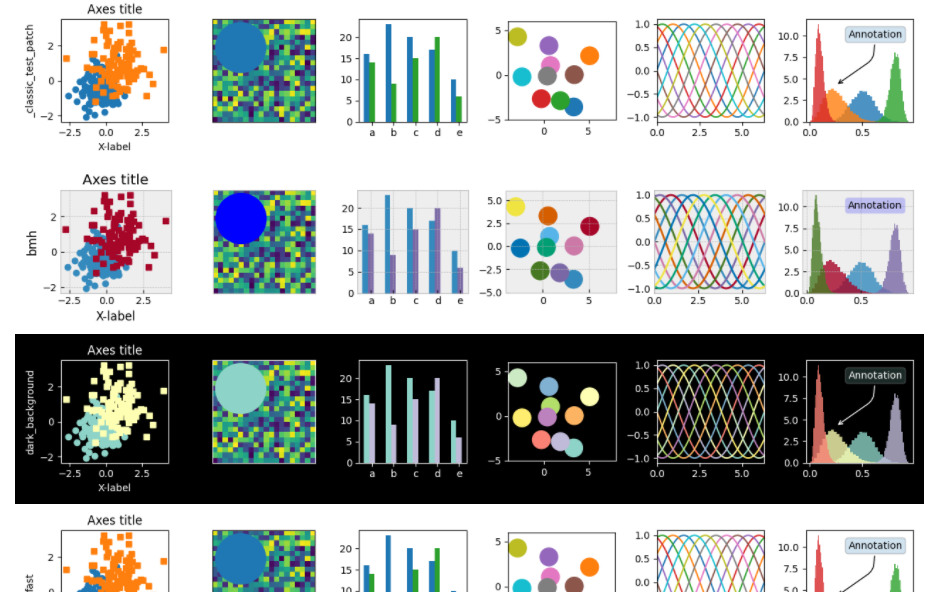

I liked the dark background so I specified in the code that I wanted the dark background. You can do this for any background you like:
```
plt.style.use('dark_background')
```
Next, we import our CSV file for the data we want to plot:
```
#import data
from google.colab import files
uploaded = files.upload()
```
I manipulated the data from the original dataset. Since I wanted to track covid cases over time for selected European countries, I made another CSV file where I filtered the data for only European countries and changed the date column to days to track Covid-19. The time period if from Jan 22,2020 to May 28,2021. A snapshot of my data file is given below:

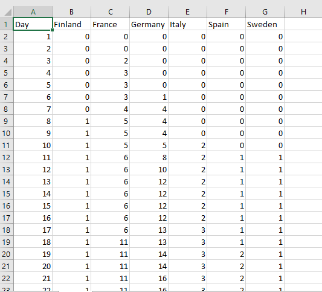

Then we write code allowing Pandas to read the csv file and do some operations on it:
```
#read csv file
data=pd.read_csv('covid.csv')
```
We can also change and shorten column names for our ease:
```
daycount=data['Day']
FIN=data['Finland']
FRA=data['France']
DEU=data['Germany']
ITA=data['Italy']
ESP=data['Spain']
SWE=data['Sweden']
```
Then we can make a plot of confirmed cases over time for these 6 countries:
```
plt.plot(daycount,FIN,label="Finland")
plt.plot(daycount,FRA,label="France")
plt.plot(daycount,DEU,label="Germany")
plt.plot(daycount,ITA,label="Italy")
plt.plot(daycount,ESP,label="Spain")
plt.plot(daycount,SWE,label="Sweden")
```

To prevent any scientific notation on the axis, we pass the code:
```
plt.ticklabel_format(style='plain') 
```
We can set the legend, title and customize our display of the axis using the following code:
```
plt.legend()
plt.title('COVID-19 cases in European Countries')
plt.ylabel('Number of Infections')
plt.xlabel('Number of Days')
```
The following code displays the graph:
```
plt.show()
```
The output of the graph is displayed below:

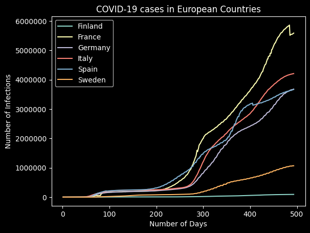


## Part 2: Using Kepler to make an animated map of COVID infections over time ##
The data obtained for Covid cases comes from [another GitHub repo about a tutorial on Kepler](https://github.com/leighhalliday/keplergl-demo). The data can be viewed from the 'Part 2 Data' folder in my repo.

The data consists of COVID cases in different countries over a three month period from Jan 22,2020 to March 24,2020. In order to make an animated map on Kepler, the Date column in this file had to be changed to date-time column. Kepler can get finicky about the date format. In order to to show an animated map, your date format needs to have a time component. Therefore I changed the format of the date column. Prior to changing, the original data looked like this:

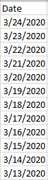

After enabling the time component in this column, my data looked like this:

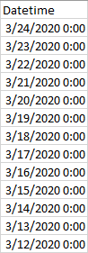

The data is now all set to go on Kepler! This is an online website and you don't need to install anything. Simply go to [Kepler.gl](Kepler.gl) and click on 'Get Started'. You will be asked to import your data file and you can drag and drop the CSV file which includes your time component in the date column in order to show the animation.

Once you import the CSV file, your screen will look something like the picture below. It does not show the covid map yet!

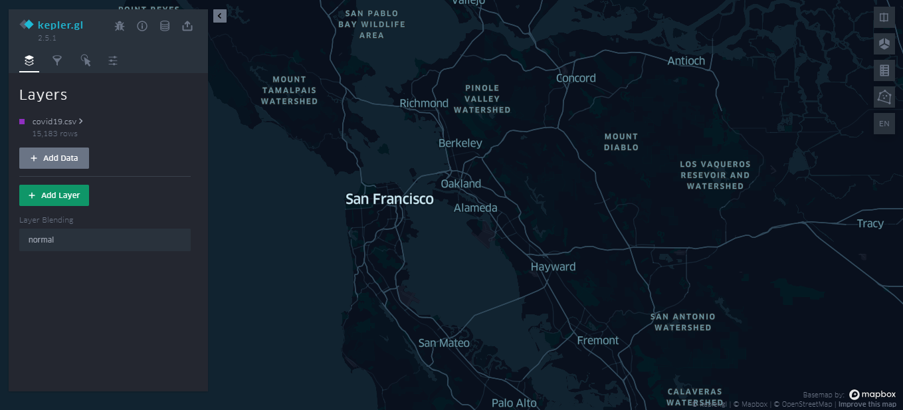

Next, you need to add a layer. You can give it any name. I gave the name 'Confirmed'. You need to select the type of your map under the 'Basic' column. I wanted to show points on the map so I chose points. Next you need to specify your latitude and longitude columns. A screenshot if given below of where you need to make these changes:

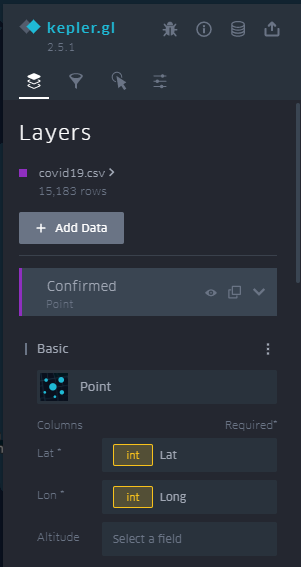

You can also change the color of the points. I chose the color red to represent COVID infections. You can adjust the radius of the circle based on how many covid infections there are in a particular place. You can do this by selecting 'value' in the 'Radius based on' column, where the 'value' field in our data represents number of cases in a particular place. A screenshot is given below for reference:

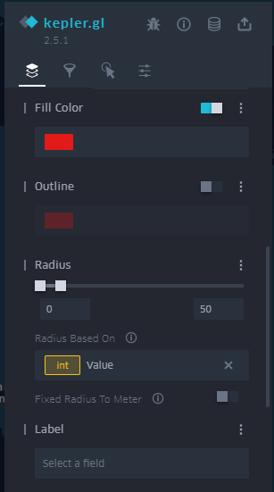

Finally your map looks something like this:

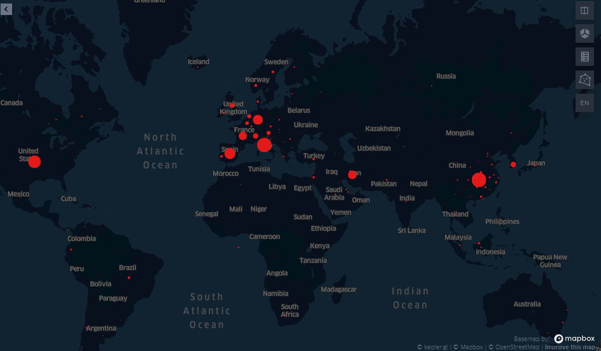

You can see that the Covid hotspots in early 2020 were China, Italy as well as Spain and Germany given the large radius of the circle. Next you need to add a filter in order to make your animated map.

The screenshot below helps guide you through this animation process. In the filter tab, click on 'Add filter' and select the 'Datetime' field (the date field that includes the time component):

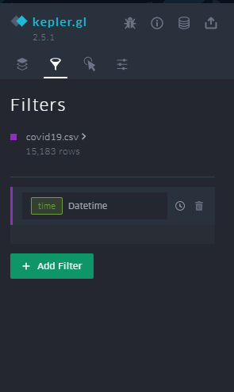

Next, a small window will appear on your map that looks like this:

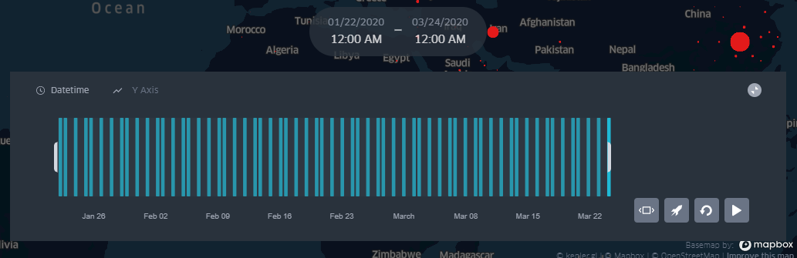

This visualization tool allows us to filter the data down to a couple of days in order to see the progress of in the infection over time. I set the filter as in the picture below:

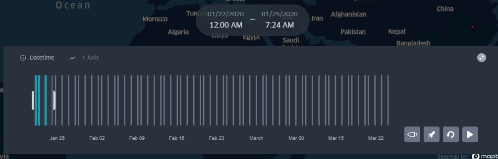

After you set the filter, simply click play and you can see how the infections spread first in China and then in the West. 

You can check out my animated map [here](https://kepler.gl/demo/map/carto?mapId=fd8b998f-1c26-db9e-1fea-81d1209a2110&owner=kulsoom-hisam&privateMap=false).


